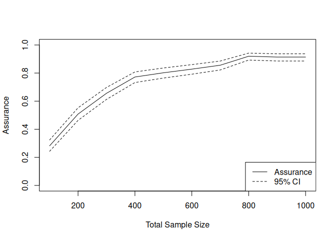

README
================

# DTEAssurance

<!-- badges: start -->

[](https://CRAN.R-project.org/package=DTEAssurance)
[](https://lifecycle.r-lib.org/articles/stages.html)
<!-- badges: end -->

**DTEAssurance** is an R package for implementing assurance methodology
in the design of clinical trials with an anticipated delayed treatment
effect (DTE).  
It uses elicited prior distributions—via the
[`SHELF`](https://CRAN.R-project.org/package=SHELF) framework—for the
delay duration and post-delay hazard ratio, and simulates operating
characteristics to inform trial design.

The methodology is based on the following papers:

- Salsbury JA, Oakley JE, Julious SA, Hampson LV.  
  [Assurance methods for designing a clinical trial with a delayed
  treatment
  effect](https://onlinelibrary.wiley.com/doi/10.1002/sim.10136).  
  *Statistics in Medicine*, 2024; 43(19): 3595–3612.
  [doi:10.1002/sim.10136](https://doi.org/10.1002/sim.10136)

- Salsbury JA, Oakley JE, Julious SA, Hampson LV.  
  [Adaptive clinical trial design with delayed treatment effects using
  elicited prior distributions](https://arxiv.org/abs/2509.07602).  
  *arXiv preprint*, 2025; arXiv:2509.07602 \[under revision at
  *Pharmaceutical Statistics*\]

## Installation

You can install `DTEAssurance` on CRAN using:

``` r
install.packages("DTEAssurance")
```

``` r
library(DTEAssurance)
```

## Assurance Methods for Delayed Treatment Effects

### `Shiny` App

Launch the interactive app to explore assurance under delayed treatment
effects:

``` r
DTEAssurance::assurance_shiny_app()
```

### Offline Example

You can also use the package offline via the main function:

``` r
DTEAssurance::calc_dte_assurance()
```

This function requires the following arguments:

- `n_c`: Number of patients in the control group
- `n_t`: Number of patients in the treatment group
- `control_model`: A named list specifying the control arm survival
  distribution
- `effect_model`: A named list specifying beliefs about the treatment
  effect
- `censoring_model`: A named list specifying the censoring mechanism
- `recruitment_model`: A named list specifying the recruitment process
- `analysis_model`: A named list specifying the statistical test and
  decision rule
- `n_sims`: Number of simulations to run

An example of this is shown:

``` r
control_model <- list(dist = "Exponential", parameter_mode = "Fixed", fixed_type = "Parameters", lambda = 0.1)
effect_model <- list(delay_SHELF = SHELF::fitdist(c(3, 4, 5), probs = c(0.25, 0.5, 0.75), lower = 0, upper = 10),
delay_dist = "gamma",
HR_SHELF = SHELF::fitdist(c(0.55, 0.6, 0.7), probs = c(0.25, 0.5, 0.75), lower = 0, upper = 1.5),
HR_dist = "gamma",
P_S = 1, P_DTE = 0)
censoring_model <- list(method = "Time", time = 12)
recruitment_model <- list(method = "power", period = 12, power = 1)
analysis_model <- list(method = "LRT", alpha = 0.025, alternative_hypothesis = "one.sided")
result <- calc_dte_assurance(n_c = 300, n_t = 300,
                             control_model = control_model,
                             effect_model = effect_model,
                             censoring_model = censoring_model,
                             recruitment_model = recruitment_model,
                             analysis_model = analysis_model,
                             n_sims = 100)

str(result)
#> List of 4
#>  $ assurance  : num 0.8
#>  $ CI         : num [1, 1:2] 0.708 0.873
#>  $ duration   : num 12
#>  $ sample_size: num 600
```

We can vary the sample sizes and plot the resulting output:

``` r

result <- calc_dte_assurance(n_c = seq(50, 500, by = 50),
                             n_t = seq(50, 500, by = 50),
                             control_model = control_model,
                             effect_model = effect_model,
                             censoring_model = censoring_model,
                             recruitment_model = recruitment_model,
                             analysis_model = analysis_model,
                             n_sims = 500)
```



## Assurance for DTE - With Group Sequential Designs

### `Shiny` App

Launch the interactive `shiny` app to explore assurance under delayed
treatment effects using group sequential designs:

``` r
DTEAssurance::assurance_GSD_shiny_app()
```

### Offline Example

You can also use the package offline via the main function:

``` r
DTEAssurance::calc_dte_assurance_adaptive()
```

This function requires the following arguments:

- `n_c`: Number of patients in the control group
- `n_t`: Number of patients in the treatment group
- `control_model`: A named list specifying the control arm survival
  distribution
- `effect_model`: A named list specifying beliefs about the treatment
  effect
- `recruitment_model`: A named list specifying the recruitment process
- `GSD_model`: A named list specifying the group sequential design
- `n_sims`: Number of simulations to run

An example of this is shown:

``` r
control_model <- list(dist = "Exponential", parameter_mode = "Fixed", fixed_type = "Parameters", lambda = 0.08)
effect_model <- list(delay_SHELF = SHELF::fitdist(c(3, 4, 5), probs = c(0.25, 0.5, 0.75), lower = 0, upper = 10),
delay_dist = "gamma",
HR_SHELF = SHELF::fitdist(c(0.55, 0.6, 0.7), probs = c(0.25, 0.5, 0.75), lower = 0, upper = 1.5),
HR_dist = "gamma",
P_S = 0.9, P_DTE = 0.7)
recruitment_model <- list(method = "power", period = 12, power = 1)
GSD_model <- list(events = 450,
                  alpha_spending = c(0.0125, 0.025),
                  alpha_IF = c(0.75, 1),
                  futility_type = "none")
result <- calc_dte_assurance_adaptive(n_c = 300, n_t = 300,
                             control_model = control_model,
                             effect_model = effect_model,
                             recruitment_model = recruitment_model,
                             GSD_model = GSD_model,
                             n_sims = 500)

str(result)
#> 'data.frame':    500 obs. of  6 variables:
#>  $ Trial     : int  1 2 3 4 5 6 7 8 9 10 ...
#>  $ Decision  : chr  "Stop for efficacy" "Stop for efficacy" "Unsuccessful at final" "Stop for efficacy" ...
#>  $ StopTime  : num  19.8 20.1 27.3 21.4 20.7 ...
#>  $ SampleSize: int  600 600 600 600 600 600 600 600 600 600 ...
#>  $ Success   : logi  TRUE TRUE FALSE TRUE TRUE FALSE ...
#>  $ Converged : logi  NA NA NA NA NA NA ...
```

``` r
design_summary <- result %>%
        summarise(
          Assurance = mean(Decision %in% c("Stop for efficacy", "Successful at final")),
          `Pr(Early Fut.)` = mean(Decision %in% c("Stop for futility")),
          `Pr(Early Eff.)` = mean(Decision %in% c("Stop for efficacy")),
          `Average Duration` = round(mean(StopTime, na.rm = TRUE), 2),
          `Average Sample Size` = round(mean(SampleSize, na.rm = TRUE), 2)
        )


design_summary
#>   Assurance Pr(Early Fut.) Pr(Early Eff.) Average Duration Average Sample Size
#> 1       0.7              0          0.516            22.47                 600
```

## Notation

The package identifiers map onto the notation of the adaptive-design
manuscript (Salsbury et al., <doi:10.48550/arXiv.2509.07602>) as follows.

| Manuscript | Package |
|---|---|
| PP, $\hat{PP}$ (predictive probability) | `PP_val`, `PP_func()` |
| $\kappa$ (futility threshold) | `kappa`, `GSD_model$kappa`, `kappa_grid`, `kappa_star` |
| $\kappa^*$ | `select_kappa_star()` |
| $\lambda_c$, $\gamma_c$ (Weibull rate, shape) | `lambda_c`, `gamma_c` |
| $HR^*$ | `post_delay_HR` (truth), `HR` (posterior column) |
| $T$ (delay) | `delay_time` |
| $Z$ (latent state) | `Z`, `P_Z1`, `P_Z2`, `P_Z3` |
| $P_S$, $P_{DTE}$ | `P_S`, `P_DTE` |
| $M$ (posterior-predictive draws) | `PP_sims` |
| retained MCMC draws | `update_priors_sims` (per chain; total = `n.chains` x this) |
| IF (information fraction) | `futility_IF`, `alpha_IF` |
| D1, ..., D5 | built post hoc from `run_paired_scenario()` output (see below) |

### Designs D1-D5 from paired replicates

`run_paired_scenario()` simulates each trial once, computes the PP at the
futility look once, and records the test statistics at the interim
(`Z_int_*`), the efficacy look (`Z_eff_*`) and the final analysis
(`Z_fin_*`) without stopping the trial. Every design is then a summary of the
same replicates. With `c_eff` and `c_fin` the critical values of the
group-sequential design at the efficacy look and the final analysis:

- **D1** (fixed design): success if `Z_fin_LRT` exceeds the final-only
  critical value.
- **D2** (efficacy look only): success if `Z_eff_LRT > c_eff`, otherwise
  `Z_fin_LRT > c_fin`. This is `continuation_success`.
- **D3** (D2 plus PP futility): stop for futility if `PP_val < kappa`;
  `summarize_grid_by_kappa()` evaluates a grid of kappa and
  `select_kappa_star()` picks kappa*.
- **D4, D5** (D2 plus Z futility): stop for futility if an interim
  statistic (`Z_int_LRT` or `Z_int_MW_t*`) is below a cutoff.

The PP futility rule is selected with `GSD_model$futility_type = "PP"` and
`GSD_model$kappa`. The names `BPP_func()`, `calibrate_BPP_threshold()`,
`calibrate_BPP_timing()`, `summarize_grid_by_lambda()`, `select_lambda_star()`,
`futility_type = "BPP"` and `GSD_model$BPP_threshold` are deprecated and will
be removed in the next release.
