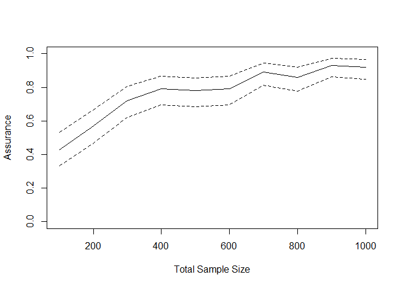
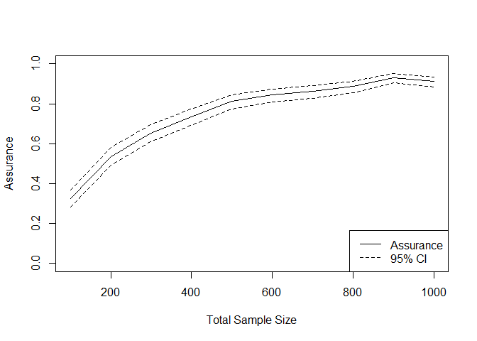

README
================

<!-- README.md is generated from README.Rmd. Please edit that file -->

# DTEAssurance

<!-- badges: start -->
<!-- badges: end -->

DTEAssurance is an R package for implementing the assurance method for a
delayed treatment effect. Distributions are elicited for the length of
delay and the post-delay hazard ratio. The package implements the
methodology from

- Salsbury JA, Oakley JE, Julious SA, Hampson LV. [Assurance methods for
  designing a clinical trial with a delayed treatment
  effect](https://onlinelibrary.wiley.com/doi/10.1002/sim.10136).
  Statistics in Medicine. 2024; 43(19): 3595-3612. doi:
  10.1002/sim.10136\]

## Installation

The \`DTEAssurance’ package is currently on GitHub only. It can be
installed and loaded using the following commands:

``` r
devtools::install_github("jamesalsbury/DTEAssurance")
library(DTEAssurance)
```

## Shiny App

A \`shiny’ app is included in the package for implementing the methods.
To launch the app, run the command:

``` r
DTEAssurance::assurance_shiny_app()
```

## Example (from the paper)

### Control

We assume the observations in the control group will be exponentially
distributed, with a median survival time
() of 8 months.
The hazard rate is

}{t_m},")

so in this case


### Eliciting beliefs about the treatment group

First, we need to elicit beliefs about the probability that the survival
curves will diverge,
. We
assume the expert judges this probability to be 0.9.

``` r
P_S <- 0.9
```

Second, we require the probability that the survival curves will be
subject to a delayed treatment effect, given they diverge,
.
We assume the expert judges this probability to be 0.7.

``` r
P_DTE <- 0.7
```

We now require the expert to consider their uncertainty about the
following two quantities: the length of the delay, and the magnitude of
the treatment effect, once the treatment begins to take effect.

### Eliciting length of delay

For the length of delay, suppose the expert provides a median of 4
months, and two quartiles (25% and 75%) of 3 and 5 months, respectively.
A Gamma(7.29,1.76) distribution is fit to these judgements

``` r
delay_time_beliefs <- SHELF::fitdist(c(3, 4, 5), probs = c(0.25, 0.5, 0.75), lower = 0, upper = 10)
SHELF::plotfit(delay_time_beliefs, d = "gamma")
```



### Eliciting post-delay hazard ratio

For the post-delay hazard ratio, suppose the expert provides a median of
0.6 and two quartiles (25% and 75%) of 0.55 and 0.7, respectively. A
Gamma(29.6, 47.8) distribution is fit to these judgements

``` r
post_delay_HR_beliefs <- SHELF::fitdist(c(0.55, 0.6, 0.7), probs = c(0.25, 0.5, 0.75), lower = 0, upper = 1.5)
SHELF::plotfit(post_delay_HR_beliefs, d = "gamma")
```



## Calculating Assurance

``` r

DTEAssurance::calc_dte_assurance(n_c = 300,
                                  n_t = 300,
                                  lambda_c = log(2)/8,
                                  control_dist = "Exponential",
                                  delay_time_SHELF = delay_time_beliefs,
                                  delay_time_dist = "gamma",
                                  post_delay_HR_SHELF = post_delay_HR_beliefs,
                                  post_delay_HR_dist = "gamma",
                                  P_S = 0.9,
                                  P_DTE = 0.7,
                                  cens_events = 150,
                                  rec_method = "power",
                                  rec_period = 12,
                                  rec_power = 1,
                                  analysis_method = "LRT",
                                  alpha = 0.05,
                                  alternative = "one.sided",
                                  rho = 0,
                                  gamma = 0,
                                  nSims = 1000)
#> $assurance
#> [1] 0.323
#> 
#> $CI_Assurance
#>             UBAssurance 
#>   0.2940164   0.3519836 
#> 
#> $duration
#> [1] 9.908946
```

``` r

nVec <- seq(30, 500, by = 50)

resultsAssurance <- sapply(nVec, function(n){
  n_c <- n_t <- n
  cens_events <- (n_c + n_t) * 0.8
DTEAssurance::calc_dte_assurance(n_c = n_c,
                                  n_t = n_t,
                                  lambda_c = log(2)/8,
                                  control_dist = "Exponential",
                                  delay_time_SHELF = delay_time_beliefs,
                                  delay_time_dist = "gamma",
                                  post_delay_HR_SHELF = post_delay_HR_beliefs,
                                  post_delay_HR_dist = "gamma",
                                  P_S = 0.9,
                                  P_DTE = 0.7,
                                  cens_events = cens_events,
                                  rec_method = "power",
                                  rec_period = 12,
                                  rec_power = 1,
                                  analysis_method = "LRT",
                                  alpha = 0.05,
                                  alternative = "one.sided",
                                  rho = 0,
                                  gamma = 0,
                                  nSims = 100)
})


assuranceSmooth <- loess(unlist(resultsAssurance[1,])~nVec)
assuranceSmooth <- loess(unlist(resultsAssurance[1,])~nVec)

unlist(resultsAssurance[2,])
#>             UBAssurance             UBAssurance             UBAssurance 
#>   0.1388077   0.3011923   0.3820784   0.5779216   0.4729652   0.6670348 
#>             UBAssurance             UBAssurance             UBAssurance 
#>   0.4936007   0.6863993   0.5993513   0.7806487   0.6540277   0.8259723 
#>             UBAssurance             UBAssurance             UBAssurance 
#>   0.6101815   0.7898185   0.6762917   0.8437083   0.7216000   0.8784000 
#>             UBAssurance 
#>   0.7216000   0.8784000

plot(nVec*2, predict(assuranceSmooth), type = "l", col = "red", ylim =c(0,1), ylab = "Power/Assurance", xlab = "Total sample size")
```


