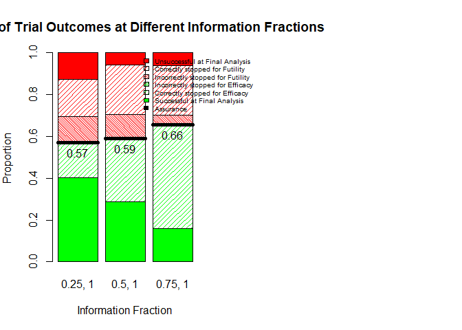

<!-- README.md is generated from README.Rmd. Please edit that file -->

``` r
library(survival)
library(rjags)
#> Loading required package: coda
#> Warning: package 'coda' was built under R version 4.1.3
#> Linked to JAGS 4.3.0
#> Loaded modules: basemod,bugs
library(SHELF)
```

# DTEAssurance

<!-- badges: start -->
<!-- badges: end -->

DTE is an R package which elicits two distributions and then calculates
assurance using these elicited prior distributions. The package
implements the methods as described in

- [this paper](https://jamesalsbury.github.io/)

## Installation

You can install the development version of DTEAssurance from
[GitHub](https://github.com/) with:

``` r
devtools::install_github("jamesalsbury/DTEAssurance")
#> Skipping install of 'DTEAssurance' from a github remote, the SHA1 (9ea69d00) has not changed since last install.
#>   Use `force = TRUE` to force installation
```

## Example (from the paper)

### Control

``` r
ZODIAC <- read.csv("data/ZODIAC.csv")
REVEL <- read.csv("data/REVEL.csv")
INTEREST <- read.csv("data/INTEREST.csv")
```

``` r

ZodiacFit <- survfit(Surv(Survival.time, Status)~1, data = ZODIAC)
plot(ZodiacFit, col = "blue", conf.int = F, xlab = "Time (months)", ylab = "Overall Survival")

RevelFit <- survfit(Surv(Survival.time, Status)~1, data = REVEL)
lines(RevelFit, col = "red", conf.int = F)

InterestFit <- survfit(Surv(Survival.time, Status)~1, data = INTEREST)
lines(InterestFit, col = "yellow", conf.int = F)

combinedControlArms <- rbind(INTEREST, REVEL, ZODIAC)

combinedFit <- survfit(Surv(Survival.time, Status)~1, data = combinedControlArms)
lines(combinedFit, col = "black", conf.int = F)

legend("topright", legend = c("ZODIAC", "REVEL", "INTEREST", "Combined"), lty = 1, col = c("blue", "red", "yellow", "black"))
```


``` r
#Performing MCMC on this data set

modelstring="

data {
  for (j in 1:n){
    zeros[j] <- 0
  }
}

model {
  C <- 10000
  for (i in 1:n){
    zeros[i] ~ dpois(zeros.mean[i])
    zeros.mean[i] <-  -l[i] + C
    l[i] <- ifelse(datEvent[i]==1, log(gamma_C)+gamma_C*log(lambda_C*datTimes[i])-(lambda_C*datTimes[i])^gamma_C-log(datTimes[i]), -(lambda_C*datTimes[i])^gamma_C)
  }
  
    lambda_C ~ dnorm(1,1/10000)T(0,)
    gamma_C ~ dnorm(1,1/10000)T(0,)
    
    }
"

model = jags.model(textConnection(modelstring), data = list(datTimes = combinedControlArms$Survival.time, datEvent = combinedControlArms$Status, n= nrow(combinedControlArms)), quiet = T) 

update(model, n.iter=1000)
output=coda.samples(model=model, variable.names=c("lambda_C", "gamma_C"), n.iter = 10000)

plot(output)
```


``` r

lambda_Csample <- as.numeric(unlist(output[,2]))
gamma_Csample <- as.numeric(unlist(output[,1]))
```

### Eliciting T

First, we use SHELF to elicit beliefs about T, the length of the delay

``` r
P_S <- 0.9
P_DTE <- 0.7
TBeliefs <- SHELF::fitdist(c(3, 4, 5), probs = c(0.25, 0.5, 0.75), lower = 0, upper = 10)
```

### Eliciting post-delay HR

and the treatment effect, in the form of the post-delay hazard ratio

``` r
HRStarBeliefs <- SHELF::fitdist(c(0.55, 0.6, 0.7), probs = c(0.25, 0.5, 0.75), lower = 0, upper = 1.5)
```

### Calculating Assurance

``` r

DTEAssurance::calculateAssurance(n_C = 100, n_E = 100, lambda_C = lambda_Csample, HRStar = HRStarBeliefs, HRStarDist = "gamma", gamma_C = gamma_Csample, gamma_E = gamma_Csample, delayT = TBeliefs, delayTDist = "gamma",
                               P_S = P_S, P_DTE = P_DTE, censEvents = 200*0.8, rec_method = "power", rec_period=12, rec_power=1, 
                               analysis_method = "WLRT", rho = 0, gamma = 1, nSims=1e1)
#> $assurance
#> [1] 0.6
#> 
#> $duration
#> [1] 28.86784
#> 
#> $LBAssurance
#> [1] 0.2963581
#> 
#> $UBAssurance
#> [1] 0.9036419
```

### Plotting Assurance curve

``` r
nVec <- seq(30, 500, by = 50)

resultsAssurance <- sapply(nVec, function(n_C){
  n_E <- n_C
  censEvents <- (n_C + n_E) * 0.8
  DTEAssurance::calculateAssurance(n_C = n_C, n_E = n_E, lambda_C = lambda_Csample, HRStar = HRStarBeliefs, HRStarDist = "gamma",
                     gamma_C = gamma_Csample, gamma_E = gamma_Csample, delayT = TBeliefs, delayTDist = "gamma",
                     P_S = P_S, P_DTE = P_DTE, censEvents = censEvents, rec_method = "power", rec_period=12, rec_power=1,
                     analysis_method = "WLRT", rho = 0, gamma = 1, nSims=1e3)
})


assuranceSmooth <- loess(unlist(resultsAssurance[1,])~nVec)

plot(nVec*2, predict(assuranceSmooth), type = "l", col = "red", ylim =c(0,1), ylab = "Power/Assurance", xlab = "Total sample size")
```



### Plotting Power

``` r

weibFit <- survreg(Surv(Survival.time, Status)~1, data = combinedControlArms, dist = "weibull")
MLE_gammaC <- as.numeric(exp(-weibFit$icoef[2]))
MLE_lambdaC <- as.numeric(1/(exp(weibFit$icoef[1])))

P_S <- 1
P_DTE <- 1

TBeliefs <- SHELF::fitdist(c(3.99, 4, 4.01), probs = c(0.25, 0.5, 0.75), lower = 0, upper = 10)
HRStarBeliefs <- SHELF::fitdist(c(0.599, 0.6, 0.601), probs = c(0.25, 0.5, 0.75), lower = 0, upper = 1.5)


resultsPower <- sapply(nVec, function(n_C){
  n_E <- n_C
  censEvents <- (n_C + n_E) * 0.8
  DTEAssurance::calculateAssurance(n_C = n_C, n_E = n_E, lambda_C = MLE_lambdaC, HRStar = HRStarBeliefs, HRStarDist = "gamma",
                     gamma_C = MLE_gammaC, gamma_E = MLE_gammaC, delayT = TBeliefs, delayTDist = "gamma",
                     P_S = P_S, P_DTE = P_DTE, censEvents = censEvents, rec_method = "power", rec_period=12, rec_power=1,
                     analysis_method = "WLRT", rho = 0, gamma = 1, nSims=1e3)
})


PowerSmooth <- loess(unlist(resultsPower[1,])~nVec)
```

### Plotting Power (no delay)

``` r

weibFit <- survreg(Surv(Survival.time, Status)~1, data = combinedControlArms, dist = "weibull")
MLE_gammaC <- as.numeric(exp(-weibFit$icoef[2]))
MLE_lambdaC <- as.numeric(1/(exp(weibFit$icoef[1])))

P_S <- 1
P_DTE <- 0

TBeliefs <- SHELF::fitdist(c(3.99, 4, 4.01), probs = c(0.25, 0.5, 0.75), lower = 0, upper = 10)
HRStarBeliefs <- SHELF::fitdist(c(0.599, 0.6, 0.601), probs = c(0.25, 0.5, 0.75), lower = 0, upper = 1.5)


resultsPowerND <- sapply(nVec, function(n_C){
  n_E <- n_C
  censEvents <- (n_C + n_E) * 0.8
  DTEAssurance::calculateAssurance(n_C = n_C, n_E = n_E, lambda_C = MLE_lambdaC, HRStar = HRStarBeliefs, HRStarDist = "gamma",
                     gamma_C = MLE_gammaC, gamma_E = MLE_gammaC, delayT = TBeliefs, delayTDist = "gamma",
                     P_S = P_S, P_DTE = P_DTE, censEvents = censEvents, rec_method = "power", rec_period=12, rec_power=1,
                      analysis_method = "WLRT", rho = 0, gamma = 1, nSims=1e3)
})


PowerNDSmooth <- loess(unlist(resultsPowerND[1,])~nVec)
```

``` r
plot(nVec*2, predict(assuranceSmooth), type = "l", col = "red", ylim =c(0,1), ylab = "Power/Assurance", xlab = "Total sample size")

lines(nVec*2, predict(PowerSmooth), lty  = 2)

lines(nVec*2, predict(PowerNDSmooth), lty  = 3, col = "blue")

legend("bottomright", legend = c("Assurance", "Power", "Power assuming no delay"), col = c("red", "black", "blue"), lty = 1:3)
```


